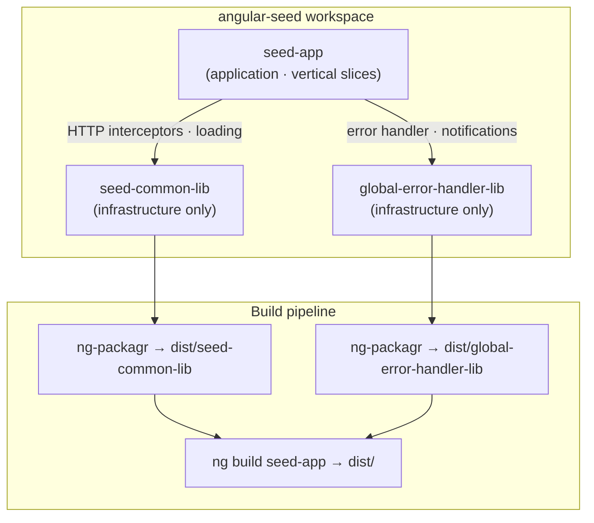
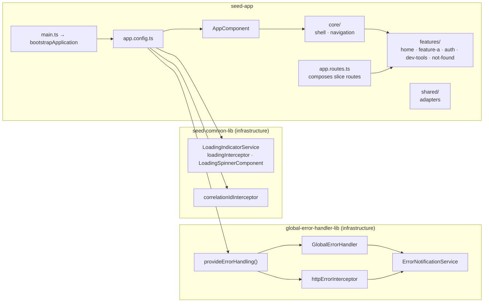
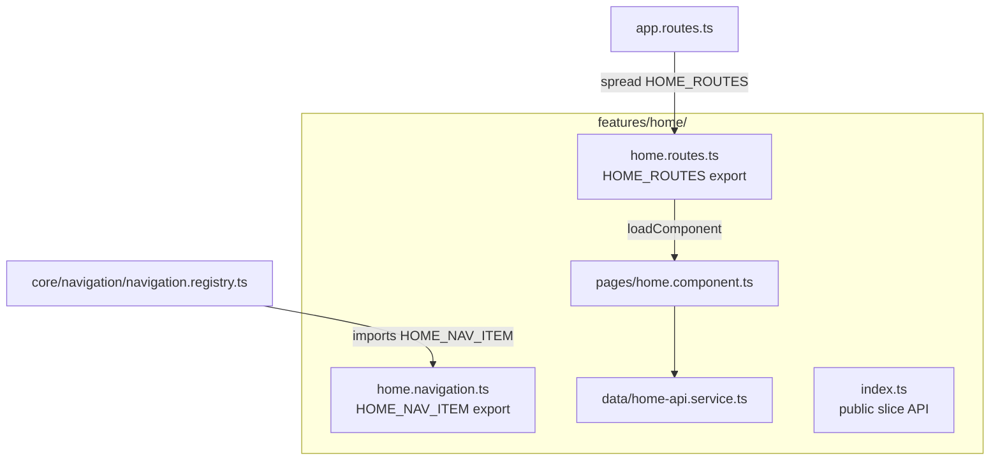
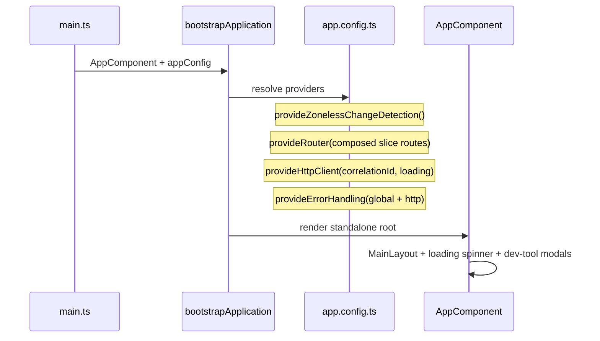
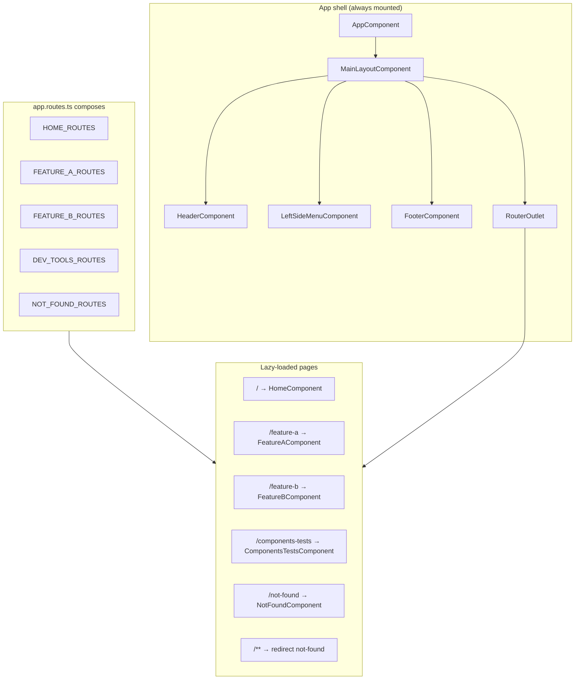
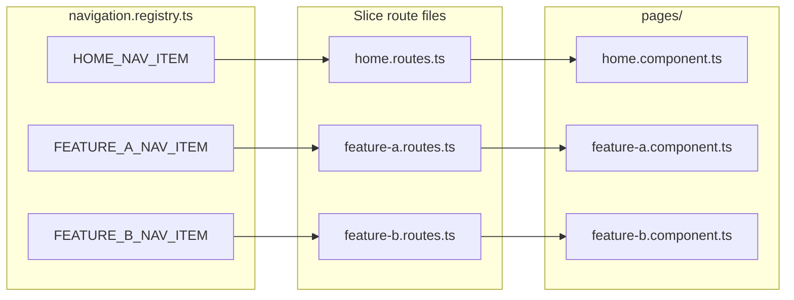
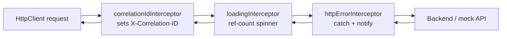
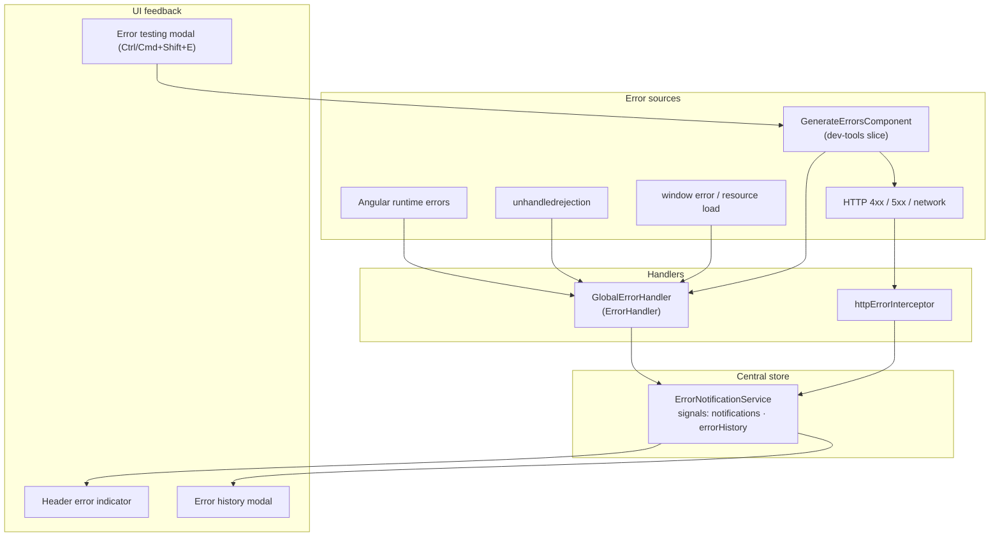
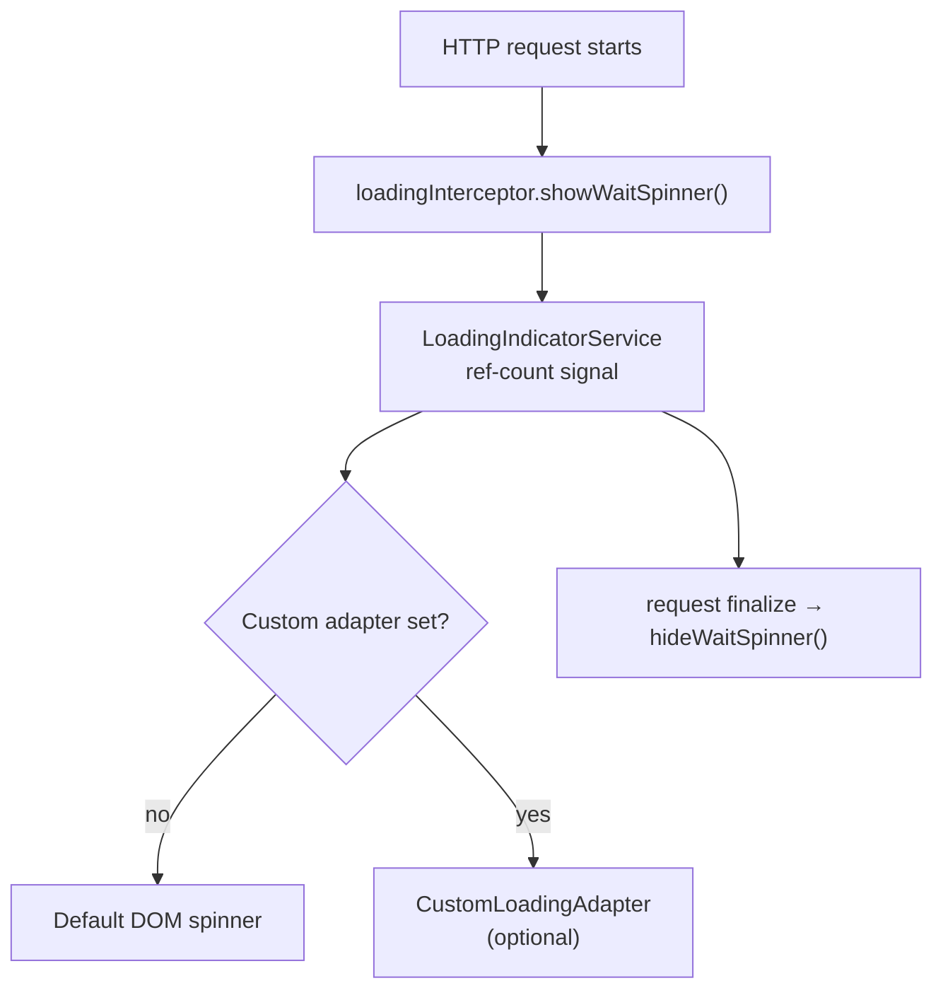

# AngularSeed

A modern Angular 22 seed project with vertical slice architecture, comprehensive error handling, workspace libraries, and strict TypeScript/ESLint tooling.

> Planned enhancements are tracked in [NICETOHAVE.md](./NICETOHAVE.md).

## Overview

### Technology Stack

- **Angular 22.0.4** - Latest Angular framework
- **TypeScript ~6.0.3** - Strongly typed JavaScript
- **pnpm** - Fast, disk space efficient package manager
- **Tailwind CSS 3** - Utility-first CSS framework (PostCSS via `@tailwindcss/postcss`)
- **SCSS** - CSS preprocessor
- **Vitest 4 + @analogjs/vite-plugin-angular** - Unit tests run through Vite; the dev server uses `ng serve` (`@angular/build`)
- **ESLint 9** - Flat-config linting with custom rules in `tools/eslint-rules/`

### Modern Angular Features

- **Zoneless Change Detection** - Performance optimization
- **Standalone Components** - No NgModules, modern architecture
- **Signals** - Reactive state management
- **Signal Forms API** - Type-safe reactive forms
- **Functional Interceptors** - Modern HTTP interceptor pattern

## Architecture

### Vertical Slice Architecture

This project uses **vertical slice architecture (VSA)**: code is organized by **user-facing capability** (use case), not by technical layer. Each slice under `features/` owns everything needed to deliver one feature end-to-end — routes, page components, data services, models, navigation entries, guards, and tests — co-located in a single folder.

**Contrast with horizontal (layered) architecture**, where all services live in `services/`, all components in `components/`, and all models in `models/`. In that style, a single feature change touches many unrelated top-level folders.

| Criterion | Layered / horizontal | Vertical slices (this seed) |
|-----------|---------------------|----------------------------|
| Change locality | One feature spans 4+ top-level folders | One feature = one folder under `features/` |
| Onboarding | Learn a global folder map first | Open `features/home/` — everything is there |
| Lazy loading | Routes scattered in a central file | Each slice exports its own `*.routes.ts` |
| Team scaling | Merge conflicts across shared folders | Teams own slices with minimal overlap |
| Feature removal | Hard to delete cleanly | Delete the slice folder + registry entries |
| Libraries | Tend to become junk drawers | Libs stay **infrastructure-only** |

**When NOT to use a slice:** code used by two or more features with no single owner belongs in `shared/` (app-level) or a workspace library (cross-app infrastructure).

### Workspace Structure



Dev builds resolve libraries from source (`public-api.ts`); production builds consume compiled output in `dist/`.

### Project Components

- **seed-app** — Main application with vertical slices (`home`, `feature-a`, `feature-b`, `auth`, `dev-tools`, `not-found`), app shell under `core/`, and cross-feature adapters under `shared/`
- **seed-common-lib** — Infrastructure only: loading indicator and correlation ID interceptors (public API in `src/public-api.ts`)
- **global-error-handler-lib** — Infrastructure only: global error handler, HTTP error interceptor, notification service, and `provideErrorHandling()` (public API in `src/public-api.ts`)
- **seed-i18n-lib** — Infrastructure only: signal-based runtime i18n, JSON locale files, `TranslatePipe`, language selector dialog, and `provideI18n()` (public API in `src/public-api.ts`)



### Slice Anatomy

Each feature slice follows the same internal structure. The `home` slice is the reference implementation:



**App folder layout:**

```
projects/seed-app/src/app/
├── app.component.ts              # thin shell
├── app.config.ts
├── app.routes.ts                 # composes exported slice routes
├── core/
│   ├── shell/                    # main-layout, header, footer, left-side-menu, angular-version
│   └── navigation/               # NavigationItem type + APP_NAV_ITEMS registry
├── features/
│   ├── home/                     # reference slice (pages, data, routes, navigation)
│   ├── feature-a/
│   ├── feature-b/
│   ├── auth/                     # signup/signin modal (AUTH_ROUTES empty; routes planned)
│   ├── dev-tools/                # error testing modals + routed /components-tests
│   └── not-found/
└── shared/
    └── adapters/                 # app-specific loading adapter
```

**Path aliases** (see `projects/seed-app/tsconfig.app.json`): `@app/core/*`, `@app/features/*`, `@app/shared/*`. Libraries resolve from source in dev and from `dist/` in production builds.

### Application Bootstrap



Zoneless change detection is enabled; `zone.js` is present only for the Vitest test environment.

### Routing and Layout



Feature routes load on demand; the shell layout (header, sidebar, footer) stays mounted across navigation. Sidebar items come from `core/navigation/navigation.registry.ts`, not hardcoded menu arrays.

**Routed vs modal features:** Only `home`, `feature-a`, `feature-b`, `dev-tools/components-tests`, and `not-found` have URL routes. Auth (`SignupSigninComponent`) and most dev-tools panels (`GenerateErrorsComponent`, `WaitSpinnerTestComponent`, etc.) are mounted in `AppComponent` and opened via keyboard shortcuts — they are not in the sidebar registry.

### Feature Routes

Each slice exports its own routes; `app.routes.ts` only spreads them together:

```typescript
export const routes: Routes = [
  ...HOME_ROUTES,
  ...FEATURE_A_ROUTES,
  ...FEATURE_B_ROUTES,
  ...DEV_TOOLS_ROUTES,
  ...NOT_FOUND_ROUTES,
  { path: '**', redirectTo: 'not-found' },
];
```



| Route | Component | Slice location |
|-------|-----------|----------------|
| `/` | `HomeComponent` | `features/home/pages/` |
| `/feature-a` | `FeatureAComponent` | `features/feature-a/pages/` |
| `/feature-b` | `FeatureBComponent` | `features/feature-b/pages/` |
| `/components-tests` | `ComponentsTestsComponent` | `features/dev-tools/components/` |
| `/not-found` | `NotFoundComponent` | `features/not-found/pages/` |

All page components are standalone, use `ChangeDetectionStrategy.OnPush`, and are lazy-loaded via `loadComponent` within their slice.

Navigation items use PrimeIcons-style class names (`pi pi-home`, etc.). Add [PrimeIcons](https://primeng.org/icons) to the app if you want those icons to render; otherwise the labels still work without them.

The home page demonstrates slice-local data access: `HomeApiService` fetches the workspace `README.md` (copied into the build output via `angular.json` assets).

### Implementing a New Feature

Follow these steps when adding a capability (example name: **Feature C**):

1. **Create the slice folder** — `features/feature-c/` with subfolders as needed: `pages/`, `data/`, `models/`, `state/`
2. **Add the page component** — `pages/feature-c.component.ts` (+ `.html`, `.scss`, `.spec.ts`)
3. **Add a data service** (if HTTP or state is needed) — `data/feature-c-api.service.ts`
4. **Export slice routes** — `feature-c.routes.ts`:

```typescript
export const FEATURE_C_ROUTES: Routes = [
  {
    path: 'feature-c',
    loadComponent: () =>
      import('./pages/feature-c.component').then((m) => m.FeatureCComponent),
  },
];
```

5. **Export navigation** (if the feature appears in the sidebar) — `feature-c.navigation.ts`:

```typescript
export const FEATURE_C_NAV_ITEM: NavigationItem = {
  labelKey: 'navigation.featureC',
  icon: 'pi pi-list',
  routerLink: '/feature-c',
};
```

6. **Register routes** — add `...FEATURE_C_ROUTES` to `app.routes.ts`
7. **Register navigation** — import `FEATURE_C_NAV_ITEM` in `core/navigation/navigation.registry.ts`
8. **Add guards/resolvers** co-located in the slice when needed (see `NICETOHAVE.md` Phase 3)
9. **Export public API** — optional `index.ts` re-exporting routes, navigation, and components
10. **Verify** — run `pnpm test:seed-app` and `pnpm lint`
11. **Extract to `shared/`** only when a second feature needs the same code (duplicate once, extract on second use)

Future infrastructure from `NICETOHAVE.md` (auth guards, API layer, signals store) should land **inside the relevant slice**, not in global horizontal folders.

### HTTP Interceptor Chain



Outgoing requests pass through correlation ID and loading interceptors first; failed responses are handled by the HTTP error interceptor, which records them via `ErrorNotificationService`.

### Error Handling Flow



`provideErrorHandling()` registers both the global `ErrorHandler` and the HTTP error interceptor; the app shell reacts to `errorHistorySignal` for the header badge and history modal.

### Loading Indicator



The service uses reference counting so overlapping requests share one spinner; an optional `LoadingIndicatorAdapter` can replace the default overlay.

## Features

### Global Error Handling

**Purpose:** Centralized error management with user-friendly notifications and detailed error tracking.

**Implementation:**
- Global error handler for Angular errors, promise rejections, and window errors
- HTTP interceptor for HTTP error handling with user-friendly messages
- Signal-based error notification service
- Error history tracking with metadata (route, timestamp, call stack, HTTP status)
- Call stack parsing and filtering
- Mock HTTP service for testing without external dependencies (in `features/dev-tools/data/`)

**Error Types:**
- Angular errors
- HTTP errors (404, 401, 402, 403, 500, network errors)
- Promise rejections
- Async errors
- Timeout errors
- Resource loading errors

**Usage:**
```typescript
import { provideErrorHandling } from 'global-error-handler-lib';

export const appConfig: ApplicationConfig = {
  providers: [
    ...provideErrorHandling({
      enableGlobalHandler: true,
      enableHttpInterceptor: true,
      enableNotifications: true,
      production: false
    })
  ]
};
```

### Loading Indicator System

**Purpose:** Reference-counted loading indicator that prevents flickering with concurrent HTTP requests.

**Implementation:**
- Reference counting algorithm for tracking active requests
- Signal-based reactive state management
- Automatic HTTP interceptor integration
- Manual control API for custom scenarios
- Debug logging (`>>>RefCount #N`)

**Algorithm:**
1. Initial: `refCount = 0`, spinner hidden
2. Request starts: `refCount++`, show spinner if `refCount === 1`
3. Request completes: `refCount--`, hide spinner if `refCount === 0`

**Usage:**
```typescript
import { provideHttpClient, withInterceptors } from '@angular/common/http';
import { loadingInterceptor } from 'seed-common-lib';

export const appConfig: ApplicationConfig = {
  providers: [
    provideHttpClient(withInterceptors([loadingInterceptor]))
  ]
};
```

### HTTP Correlation ID Interceptor

**Purpose:** Automatic unique correlation ID headers for request tracking across distributed systems.

**Implementation:**
- UUID generation (with timestamp fallback)
- `X-Correlation-ID` header injection
- Exported constant for header name reuse

**Usage:**
```typescript
import { correlationIdInterceptor } from 'seed-common-lib';

export const appConfig: ApplicationConfig = {
  providers: [
    provideHttpClient(withInterceptors([correlationIdInterceptor]))
  ]
};
```

### Signup/Signin Component

**Purpose:** Modern form component demonstrating Angular v22 Signal Forms API patterns.

**Access:** Modal in `AppComponent` (Ctrl/Cmd+Shift+U for signup, Ctrl/Cmd+Shift+I for signin). `AUTH_ROUTES` in `features/auth/auth.routes.ts` is currently empty — dedicated auth routes are planned in `NICETOHAVE.md`.

**Implementation:**
- Signal Forms API (`form()` function from `@angular/forms/signals`)
- Signal-based form models (writable signals)
- Schema-based validation with path-based validators
- Computed signals for cross-field validation
- Field directive (`[field]`) instead of `formControlName`
- Signal inputs/outputs (`input()`, `output()`)
- Signal-based modal state management
- Separated models, initial data, and validation schemas for SignIn and SignUp

**Model Structure:**

The component uses a clean separation of concerns with separate interfaces, initial data, and validation schemas for SignIn and SignUp:

**Location:** `projects/seed-app/src/app/features/auth/models/signup-signin.ts`

**SignIn:**
- `SignIn` interface - Type definition for sign-in form data
- `signInItialData` - Initial empty values for sign-in form
- `signInSchema` - Validation schema with email and password rules

**SignUp:**
- `SignUp` interface - Extends `SignIn` interface, adds `confirmPassword` field
- `signUpInitialData` - Initial empty values for sign-up form
- `signUpSchema` - Validation schema with email, password, and confirmPassword rules

**Example:**
```typescript
// Models are imported from the models file
import { signInItialData, signInSchema, signUpInitialData, signUpSchema, type SignIn, type SignUp } from '../models/signup-signin';

// Component uses the imported models and schemas
readonly signUpModel = signal<SignUp>(signUpInitialData);
readonly signUpForm = form(this.signUpModel, signUpSchema);

readonly signInModel = signal<SignIn>(signInItialData);
readonly signInForm = form(this.signInModel, signInSchema);
```

**Benefits of Separation:**
- **Reusability** - Models and schemas can be shared across components
- **Maintainability** - Validation rules are centralized in one location
- **Type Safety** - Interfaces ensure consistent data structures
- **Testability** - Models and schemas can be tested independently
- **Single Source of Truth** - Initial data and validation rules defined once

### Slide Toggle Component

**Purpose:** Custom form control component demonstrating Angular 22 Signal Forms integration with `FormCheckboxControl` interface.

**Key Technology:** **Signal Forms API** - This component uses the modern Signal Forms approach, eliminating the need for `ControlValueAccessor`.

**Why No ControlValueAccessor?**

In Angular 22's Signal Forms API, custom form controls implement either:
- `FormCheckboxControl` for checkbox/boolean-based controls
- `FormValueControl<T>` for other value-based controls (text, number, select, etc.)

Both interfaces replace `ControlValueAccessor` and provide:

1. **Automatic Integration** - The `Field` directive automatically binds form fields to components implementing `FormCheckboxControl`
2. **Signal-Based State** - Uses `model()` signals for two-way data binding instead of callback functions
3. **Type Safety** - Full TypeScript type checking for form values
4. **Simplified API** - No need to implement `writeValue()`, `registerOnChange()`, `registerOnTouched()`, or `setDisabledState()`
5. **Reactive by Default** - Signal-based reactivity eliminates manual change detection triggers

**Implementation:**
- Implements `FormCheckboxControl` interface from `@angular/forms/signals`
- Uses `checked = model<boolean>(false)` for two-way binding (replaces `ControlValueAccessor`)
- Uses `touched = model<boolean>(false)` for touch state management
- Signal inputs for form state: `disabled`, `readonly`, `hidden`, `invalid`, `errors`, `disabledReasons`
- Signal inputs for component-specific props: `orientation`, `spin`, `knobColor`, etc.
- `ChangeDetectionStrategy.OnPush` for optimal performance
- Standalone component (default in Angular 22)

**Example:**
```typescript
@Component({
  selector: 'app-slide-toggle',
  changeDetection: ChangeDetectionStrategy.OnPush,
})
export class SlideToggleComponent implements FormCheckboxControl {
  // Required by FormCheckboxControl - replaces ControlValueAccessor
  checked = model<boolean>(false);
  touched = model<boolean>(false);

  // Form state provided by Field directive (read-only)
  disabled = input<boolean>(false);
  readonly = input<boolean>(false);
  invalid = input<boolean>(false);
  errors = input<readonly WithOptionalField<ValidationError>[]>([]);

  // Component-specific inputs
  orientation = input<'horizontal' | 'vertical'>('horizontal');
  spin = input<boolean>(false);

  onToggle(): void {
    if (this.disabled() || this.readonly()) return;
    this.checked.update(v => !v);
    this.touched.set(true);
  }
}
```

**Usage with Signal Forms:**
```html
<app-slide-toggle
  [field]="myForm.toggle"
  [orientation]="'horizontal'"
  [spin]="false"
></app-slide-toggle>
```

The `[field]` binding automatically:
- Syncs the `checked` model with the form field value
- Sets `disabled`, `readonly`, `invalid`, and `errors` inputs based on form state
- Handles validation and error display
- Manages touch state

### Components Test Component

**Purpose:** Interactive testing and demonstration component for the slide-toggle component with full Signal Forms integration.

**Location:** `projects/seed-app/src/app/features/dev-tools/components/components-tests/`

**Access:** Routed at `/components-tests`, or opened as a modal via Ctrl/Cmd+Shift+C from `AppComponent`.

**Implementation:**
- Signal Forms API with `form()` function
- Signal-based form model (`signal<SlideToggleFormValue>`)
- Field directive binding (`[field]="slideToggleForm.toggle"`)
- Dynamic field state management using `disabled()` function
- Computed signals for reactive form status and values
- Effect-based status updates

**Key Features:**
- Real-time form validation status display
- Interactive test controls for toggle state, orientation, spin, and disabled state
- Form value display with JSON formatting
- Component status tracking (on/off/wait states)

**Example:**
```typescript
@Component({
  selector: 'app-components-tests',
  changeDetection: ChangeDetectionStrategy.OnPush,
})
export class ComponentsTestsComponent {
  slideToggleModel = signal<SlideToggleFormValue>({
    toggle: false,
    orientation: 'horizontal',
    spin: false,
  });

  isToggleDisabled = signal<boolean>(false);

  // Signal Forms - no ControlValueAccessor needed
  slideToggleForm = form(this.slideToggleModel, (fieldPath) => {
    disabled(fieldPath.toggle, () => this.isToggleDisabled());
  });

  formStatus = computed(() => {
    return this.slideToggleForm().valid() ? 'VALID' : 'INVALID';
  });
}
```

**Signal Forms Benefits:**
- **No ControlValueAccessor** - Direct integration via `FormCheckboxControl` or `FormValueControl<T>`
- **Automatic State Sync** - Field directive handles all form state synchronization
- **Type Safety** - Full TypeScript support for form values and validation
- **Reactive Updates** - Signal-based reactivity ensures UI stays in sync
- **Simplified Code** - Less boilerplate compared to reactive forms with `ControlValueAccessor`

**FormCheckboxControl vs FormValueControl<T>:**

- **`FormCheckboxControl`** - For boolean/checkbox controls:
  ```typescript
  export class MyCheckboxComponent implements FormCheckboxControl {
    checked = model<boolean>(false);
    touched = model<boolean>(false);
    disabled = input<boolean>(false);
    // ... other FormCheckboxControl properties
  }
  ```

- **`FormValueControl<T>`** - For other value-based controls (text, number, select, etc.):
  ```typescript
  export class MyInputComponent implements FormValueControl<string> {
    value = model<string>('');
    touched = model<boolean>(false);
    disabled = input<boolean>(false);
    // ... other FormValueControl properties
  }
  ```

Both interfaces eliminate the need for `ControlValueAccessor` and provide the same benefits: automatic form integration, type safety, and signal-based reactivity.

### Dev-tools Slice

**Purpose:** Local development utilities for exercising error handling, loading indicators, and Signal Forms components.

| Component | Access | Role |
|-----------|--------|------|
| `GenerateErrorsComponent` | Ctrl/Cmd+Shift+E modal | Triggers JS, HTTP, and notification errors for manual testing |
| `WaitSpinnerTestComponent` | Ctrl/Cmd+Shift+W modal | Exercises the loading indicator interceptor |
| `ComponentsTestsComponent` | `/components-tests` route or Ctrl/Cmd+Shift+C modal | Slide-toggle Signal Forms demo |
| `SlideToggleComponent` | Used inside components-tests | Custom `FormCheckboxControl` example |
| `MockHttpService` | Imported by generate-errors tests | Mock HTTP responses (`features/dev-tools/data/`) |

## Configuration

### TypeScript Configuration

**Purpose:** Strict type safety to prevent type-related bugs and ensure code reliability.

**Key Settings:**

| Setting | Purpose | Rationale |
|---------|---------|-----------|
| `strict: true` | Enables all strict type-checking options | Maximum type safety |
| `noUncheckedIndexedAccess: true` | Requires explicit checks for array/object access | Prevents undefined access errors |
| `noImplicitOverride: true` | Requires explicit `override` keyword | Prevents accidental method overrides |
| `target: "ES2022"` | Compiles to ES2022 JavaScript | Modern language features |
| `module: "preserve"` | Preserves ES module syntax | Better tree-shaking |
| `moduleResolution: "bundler"` | Bundler-aware module resolution | Optimized for modern bundlers |
| `incremental: true` | Enables incremental compilation | Faster build performance |
| `noEmitOnError: true` | Prevents emitting files on compilation errors | Ensures build integrity |
| `baseUrl: "./"` | Sets base directory for module resolution | Simplifies path aliases |
| `strictTemplates: true` | Type-checks Angular templates | Catches template errors at build time |
| `strictInjectionParameters: true` | Requires explicit types for injection parameters | Prevents DI runtime errors |
| `strictInputAccessModifiers: true` | Enforces access modifiers on component inputs | Angular best practices |

### ESLint Configuration

**Purpose:** Code quality enforcement with ESLint 9+ flat config format.

**Why `.mjs` Format:**
1. Modern ESLint 9+ flat config support
2. Native ES module syntax (`import`/`export`)
3. Better IDE support and type checking
4. Programmatic configuration support
5. Future-proof alignment with ESLint direction

**Rules Configuration:**

**Base:**
- `@eslint/js` - Recommended JavaScript rules

**TypeScript:**
- `typescript-eslint/strictTypeChecked` - Strict type-checked rules (includes many type-safety rules automatically)
- `typescript-eslint/stylisticTypeChecked` - Stylistic rules with type information (includes code style rules automatically)

**Note:** The `strictTypeChecked` and `stylisticTypeChecked` configs include many rules automatically. The explicit rules listed below are additional customizations or overrides.

**Base JavaScript Rules:**
- `no-console` - Warns on console statements (allows `console.warn` and `console.error`)
- `no-debugger` - Prevents debugger statements
- `no-alert` - Prevents alert statements
- `no-eval` - Prevents eval usage
- `no-new-func` - Prevents Function constructor usage
- `no-throw-literal` - Requires throwing Error objects
- `no-param-reassign` - Prevents parameter reassignment
- `prefer-const` - Enforces const for variables that are never reassigned
- `no-var` - Prevents var declarations
- `no-await-in-loop` - Warns on await in loops
- `prefer-promise-reject-errors` - Requires Error objects in promise rejections
- `complexity` - Warns on high complexity (max: 15)
- `max-depth` - Warns on deeply nested blocks (max: 4)
- `max-params` - Warns on too many parameters (max: 4)

**Custom TypeScript Rules:**
- `@typescript-eslint/consistent-type-imports` - Enforces `type` keyword for type-only imports (with inline-type-imports fix style)
- `@typescript-eslint/no-floating-promises` - Requires promise handling
- `@typescript-eslint/no-misused-promises` - Prevents incorrect promise usage
- `@typescript-eslint/no-unnecessary-condition` - Flags always-true/false conditions
- `@typescript-eslint/prefer-nullish-coalescing` - Prefers `??` over `\|\|` (with ignoreConditionalTests and ignoreMixedLogicalExpressions)
- `@typescript-eslint/prefer-optional-chain` - Prefers `?.` over verbose null checks
- `@typescript-eslint/no-explicit-any` - Warns on explicit `any` usage (encourages proper typing)
- `@typescript-eslint/use-unknown-in-catch-callback-variable` - Requires `unknown` in catch clauses
- `@typescript-eslint/no-unused-vars` - Catches unused variables (allows `_` prefix, ignores rest siblings)
- `@typescript-eslint/await-thenable` - Prevents awaiting non-promise values
- `@typescript-eslint/no-confusing-void-expression` - Prevents confusing void expressions (with ignoreArrowShorthand)
- `@typescript-eslint/no-unnecessary-type-assertion` - Flags unnecessary type assertions
- `@typescript-eslint/prefer-as-const` - Prefers `as const` for literal types
- `@typescript-eslint/prefer-includes` - Prefers `.includes()` over `.indexOf() !== -1`
- `@typescript-eslint/prefer-string-starts-ends-with` - Prefers `.startsWith()`/`.endsWith()` over regex
- `@typescript-eslint/restrict-plus-operands` - Ensures type-safe addition operations
- `@typescript-eslint/restrict-template-expressions` - Ensures type-safe template expressions
- `@typescript-eslint/unbound-method` - Prevents calling unbound methods
- `@typescript-eslint/no-unnecessary-boolean-literal-compare` - Flags unnecessary boolean comparisons
- `@typescript-eslint/no-meaningless-void-operator` - Prevents meaningless void operators
- `@typescript-eslint/prefer-regexp-exec` - Prefers `RegExp.exec()` over `String.match()`
- `@typescript-eslint/return-await` - Requires return await in try-catch blocks
- `@typescript-eslint/no-misused-new` - Prevents misusing new operator
- `@typescript-eslint/no-this-alias` - Prevents aliasing this
- `@typescript-eslint/no-non-null-assertion` - Warns on non-null assertions
- `@typescript-eslint/require-await` - Requires async functions to use await

**Angular Component/Directive Rules:**
- `@angular-eslint/component-selector` - Enforces `kebab-case` with `app`/`lib` prefix
- `@angular-eslint/directive-selector` - Enforces `camelCase` attribute selectors
- `@angular-eslint/no-empty-lifecycle-method` - Prevents empty lifecycle methods
- `@angular-eslint/use-lifecycle-interface` - Requires implementing lifecycle interfaces
- `@angular-eslint/prefer-standalone` - Encourages standalone components

**Angular Template Rules:**
- `@angular-eslint/template/no-negated-async` - Prevents negated async pipes
- `@angular-eslint/template/use-track-by-function` - Requires trackBy functions in `*ngFor`
- All rules from `@angular-eslint/template/recommended` config

**JavaScript Files Rules:**
- `no-unused-vars` - Warns on unused variables in `.js`, `.jsx`, `.cjs`, `.mjs` files (allows `_` prefix)

**Custom Rules (see `tools/eslint-rules/README.md` for full details):**
- `@typescript-eslint/no-deprecated` - Built-in rule that detects `@deprecated` JSDoc tags (currently disabled to avoid duplicates)
- `custom/detect-deprecated` - Custom rule for deprecated detection with custom messages, `allowedInFiles`, and `reportUsage` options
- `custom/detect-type-assertion` - Custom rule that warns on TypeScript type assertion (casting) usage (`value as Type`, `<Type>value`); options: `allowedInFiles`, `customMessage` with `{{typeText}}`

**Disabled Rules:**

Rules are disabled only when necessary, with inline comments explaining why:

| Category | Count | Rule | Reason |
|----------|-------|------|--------|
| Test Framework | 15 | `no-unsafe-assignment`, `no-unsafe-member-access` | Vitest type limitations |
| Error Testing | 2 | `no-unsafe-call`, `no-unsafe-member-access` | Intentional error triggers |
| Runtime Safety | 6 | `no-unnecessary-condition`, `no-base-to-string` | Runtime type checking needed |
| Angular Architecture | 2 | `no-extraneous-class` | Angular DI requirements |

## Development

### Prerequisites

- **Node.js** — use the version in [`.nvmrc`](./.nvmrc) (`24.15.0` at time of writing). Angular CLI 22 requires Node `v22.22.3+`, `v24.15.0+`, or `v26.0.0+`.
- **pnpm** (v8 or higher) — [Install pnpm](https://pnpm.io/installation)

### Quick Start

```bash
# Install dependencies
pnpm install

# Start development server
pnpm start

# Run tests
pnpm run test:all

# Lint code
pnpm run lint:all
```

### Build Commands

```bash
# Build all libraries and app
pnpm run build:all

# Build individual libraries
pnpm run build:seed-common-lib
pnpm run build:global-error-handler-lib
```

### Test Commands

Tests use **Vitest 4** with **`@analogjs/vite-plugin-angular`** (JIT), **jsdom**, and **`vitest.setup.ts`** (loads `zone.js` for Angular TestBed). See `vitest.config.ts` and `tsconfig.vitest.json`. Coverage output: `./coverage/`.

```bash
# Run all tests
pnpm test              # alias for test:all
pnpm run test:all

# Run with coverage
pnpm run test:coverage

# Run with UI
pnpm run test:watch
pnpm run test:ui

# Run tests for specific project
pnpm run test:seed-app
pnpm run test:seed-common-lib
pnpm run test:global-error-handler-lib
```

### Lint Commands

```bash
# Lint all projects
pnpm run lint:all

# Lint individual projects
pnpm run lint:seed-app
pnpm run lint:seed-common-lib
pnpm run lint:global-error-handler-lib

# Check type assertion (cast) usage across all .ts files
pnpm run lint:type-assertions
```

### Deployment

Production builds use base href `/angular-seed/` for GitHub Pages:

```bash
pnpm run build:all     # build libs + app
pnpm run gitdeploy     # publish dist/ via gh-pages
```

There is no Netlify configuration in this repo; deployment is oriented around **gh-pages**.

## Guidelines

### Angular Best Practices

When creating new components, services, pipes, or directives:

1. **Standalone Components** - No NgModules, use direct imports (default in Angular 22)
2. **OnPush Change Detection** - Always use `ChangeDetectionStrategy.OnPush`
3. **Modern Control Flow** - Use `@if`, `@for`, `@switch` instead of structural directives
4. **Zoneless Change Detection** - App uses `provideZonelessChangeDetection()`
5. **Signals over RxJS** - Prefer Angular signals for state management
6. **Signal Inputs/Outputs** - Use `input()` and `output()` instead of decorators
7. **Signal Forms API** - Use Signal Forms (`form()`, `Field` directive) for new forms
8. **FormCheckboxControl/FormValueControl for Custom Controls** - Implement `FormCheckboxControl` (for boolean/checkbox) or `FormValueControl<T>` (for other values) instead of `ControlValueAccessor` for custom form controls
9. **Functional Interceptors** - Use functional HTTP interceptors

### Code Quality Standards

- All components use `ChangeDetectionStrategy.OnPush`
- All state management uses Angular signals
- All new forms use Signal Forms API (`form()`, `Field` directive)
- Custom form controls implement `FormCheckboxControl` (for boolean/checkbox) or `FormValueControl<T>` (for other values) - no `ControlValueAccessor` needed
- All HTTP interceptors are functional
- All ESLint rules are followed (with documented exceptions)
- All TypeScript strict mode rules are enabled

## Reference

### Signal Forms Locations

Signal Forms are marked with `// SignalForm` comments throughout the codebase. Here are the locations:

**Form Definitions (TypeScript):**
- `projects/seed-app/src/app/features/dev-tools/components/components-tests/components-tests.component.ts` - `slideToggleForm`
- `projects/seed-app/src/app/features/auth/components/signup-signin/signup-signin.component.ts` - `signUpForm`, `signInForm`

**Field Bindings (Templates):**
- `projects/seed-app/src/app/features/dev-tools/components/components-tests/components-tests.component.html` - `[field]="slideToggleForm.toggle"`
- `projects/seed-app/src/app/features/auth/components/signup-signin/signup-signin.component.html` - Multiple `[field]` bindings:
  - `[field]="signUpForm.email"` (line 22)
  - `[field]="signUpForm.password"` (line 37)
  - `[field]="signUpForm.confirmPassword"` (line 53)
  - `[field]="signInForm.email"` (line 112)
  - `[field]="signInForm.password"` (line 127)

**FormCheckboxControl Implementation:**
- `projects/seed-app/src/app/features/dev-tools/components/slide-toggle/slide-toggle.component.ts` - `SlideToggleComponent` implements `FormCheckboxControl`

### Internationalization (i18n)

Runtime i18n is provided by **`seed-i18n-lib`**. Locale files live in `projects/seed-app/public/assets/i18n/` as editable JSON (`en.json`, `hu.json`, `de.json`).

**Setup** — already wired in `app.config.ts`:

```typescript
...provideI18n({
  defaultLocale: 'en',
  supportedLocales: ['en', 'hu', 'de'],
}),
```

**Templates** — import `TranslatePipe` and use dot-notation keys:

```html
<h1>{{ 'features.home.welcome' | translate }}</h1>
```

**Navigation slices** — use `labelKey` in `*.navigation.ts` (e.g. `labelKey: 'navigation.home'`).

**TypeScript** — inject `TranslationService` and call `translate('key', { param: value })`.

**Vertical slice convention** — add keys under `features.<sliceName>` and `navigation.*` in all three JSON files.

**Tests** — use `provideI18nTesting()` instead of `provideI18n()` to avoid app initializer side effects.

### Keyboard Shortcuts

- **Ctrl+Shift+E** / **Cmd+Shift+E** - Open error testing modal
- **Ctrl+Shift+W** / **Cmd+Shift+W** - Open loading spinner test modal
- **Ctrl+Shift+U** / **Cmd+Shift+U** - Open signup modal
- **Ctrl+Shift+I** / **Cmd+Shift+I** - Open signin modal
- **Ctrl+Shift+C** / **Cmd+Shift+C** - Open components test component to show slide toggle component to demonstrate how it work
- **Ctrl+Shift+L** / **Cmd+Shift+L** - Open language selector dialog (English, Hungarian, German)

### Resources

- [Angular CLI Overview](https://angular.dev/tools/cli)
- [Angular Signals Documentation](https://angular.dev/guide/signals)
- [Angular Standalone Components](https://angular.dev/guide/components/importing)
- [Tailwind CSS Documentation](https://tailwindcss.com/docs)


## Known issues and planned work

**Lint status:** ESLint reports **0 errors** across the workspace. Fifteen **intentional warnings** remain in `tools/eslint-rules/example-deprecated.ts` and `tools/eslint-rules/detect-type-assertion.ts` — these files exist to validate custom rules and are excluded from cleanup.

**Planned seed features** (auth guards, API layer, etc.) are listed in [NICETOHAVE.md](./NICETOHAVE.md).

**Maintenance notes:**
- `seed-common-lib` and `global-error-handler-lib` may still contain legacy source under `src/lib/` that is no longer exported from `public-api.ts`; dev-tools UI and mock HTTP live in the `features/dev-tools/` slice.
- When `provideErrorHandling({ enableHttpInterceptor: true })` is used, the error-handling provider registers its own `provideHttpClient` — be mindful of duplicate HTTP client setup when extending `app.config.ts`.